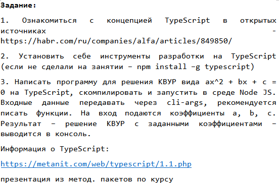
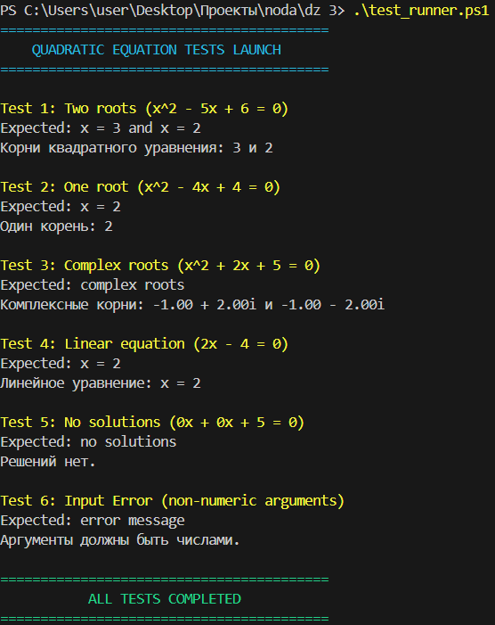

# Решатель квадратных уравнений (TypeScript)

CLI приложение для решения квадратных уравнений.

## Задание

1 - Я ознакомился с концепцией TypeScript

2 - Необходимые инструменты для разработки были установлены

3 - Программа написана. Признаюсь, брал концепт с инета, сам лишь доработал работу с командной строкой.

## Тесты

Решил сгенерить для удобства файл тестов на windows. - test_runner.ps1.

Была проблема с кодировкой на русском, даже если подставлять нужную кодировку символов в знаках бывало ошибку выбрасывал, так что все на англ.

